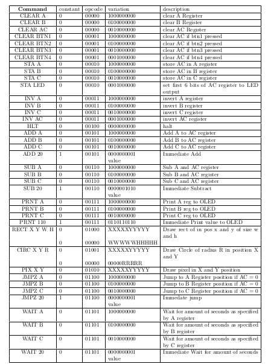

# FPGA-Console 

    

## A Simple Game Console built from the Ground Up, from its CPU design to game design using FPGA

- Using Tang Nano 9k FPGA, custom CPU is created
- ESP8266 and SSD1306 acts as a Screen controller. ESP8266 and SSD1306 communicate with I2C protocol
- Uses OSS-CAD tools
- CPU and screen controller talks with each other through UART. 
- FPGA and flash memory communicates using SPI protocol
- FPGA and display module communicates using UART 

# Tools and Stuff

- **FPGA used** : Tang Nano 9k
- **Screen** : SSD1306
- **Synthesis** : Yosys,synth_gowin
- **place and Route**: nextpnr-gowin
- **Bitstream generator**: gowin_pack
- **load**: openFPGALoader
- **Assembler**: Written In Rust

# CPU 

> You need OSS-CAD-SUITE

- load CPU into FPGA
    `cd cpu; make all`
- flash your game to FPGA
    `openFPGALoader -b tangnano9k --external-flash ./cpu/games/pong.bin`

- To verify specific module
    `iverilog ./cpu/uart.v; vvp a.out; gtkwave new_created.vcd`

  

    
    <h4>Fig: FPGA in Action</h4>

## Architecture of CPU

<h4>Fig: Architecture of CPU </h4>

--------------

<h4>Table: ISA Table</h4>

--------------

<h4>Timing Diagram for CPU</h4>

## Schematic Diagram

 
